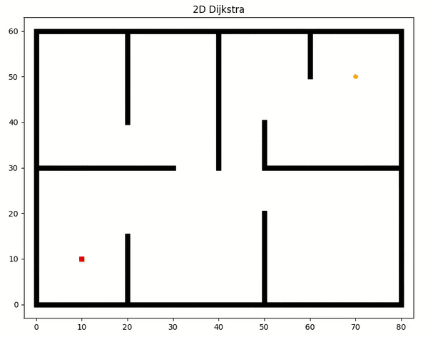
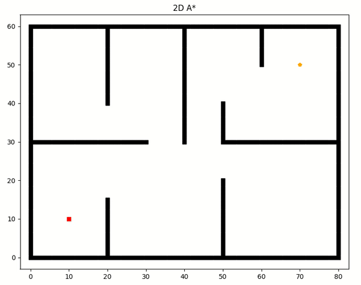
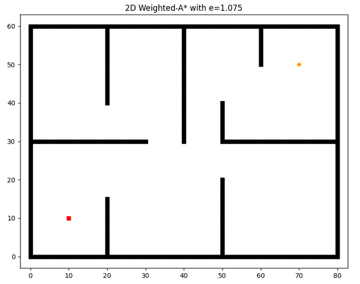

# Graph search based planning algorithms
This repo contains implementation of graph search based planning algorithms.

##### Algorithms :
* Dijkstra
* A*
* Weighted A*

Install the requirements using pip. 
```
pip3 install -r requirements.txt
```
Then, run different algorithms.
```
python3 Astar.py
python3 Dijstra.py
```
Weighted A* and Dijkstra both can be run from `Astar.py` by selecting algorithm id in the program file.

## Visualization

<p align="center">
  
</p>
<p align="center">
  
</p>
<p align="center">
  
</p>
<p align="center">
  
</p>

